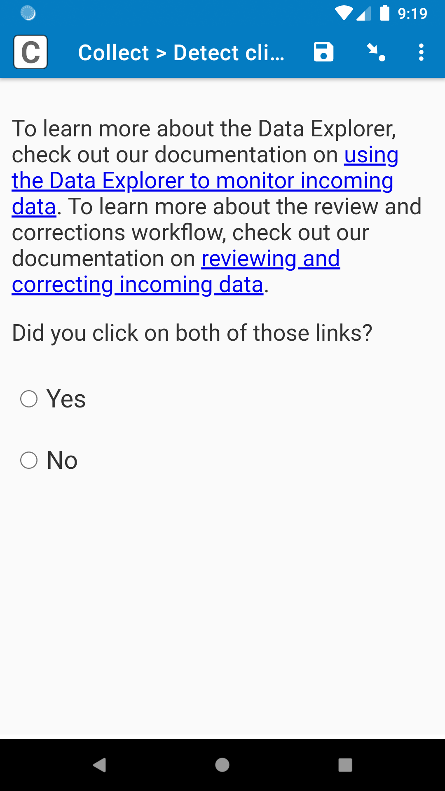
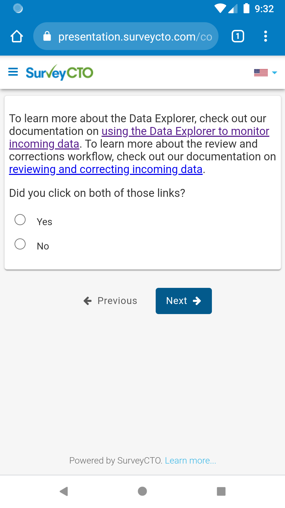
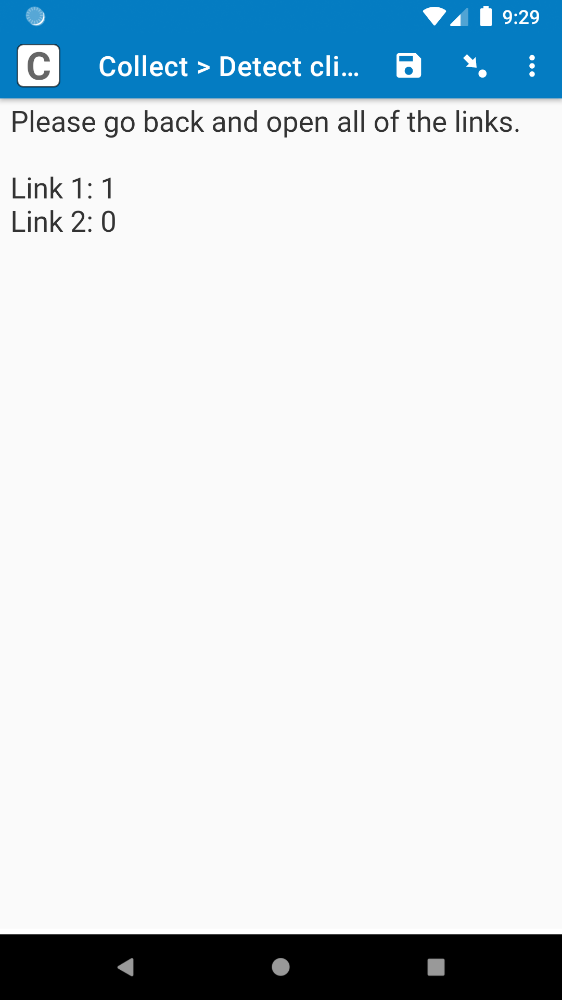

# Detect clicked link

|||
|:---:|:---:|
|Web form|Example results|

## Description

This field plug-in can be used to determine how many times each link has been clicked. You can use this to make sure the enumerator has clicked on all needed links before moving on in the form.

*This plug-in is currently under beta. If you you find a problem with the field plug-in, please email support@surveycto.com, or submit an issue to this GitHub repo.*

## Features

* Automatically detect each link in the form by searching for the [`<a>` HTML tag](https://developer.mozilla.org/en-US/docs/Web/HTML/Element/a).
* Detect the number of times a link has been clicked in a field.
* Remembers number of times links clicked even when leaving field and coming back.
* All of the capabilities of the [select_one-select_multiple](https://github.com/surveycto/select_one-select_multiple/blob/master/README.md) field plug-in.

### Requirements

Android: Android 7 or up

iOS and web browsers: Because web browsers and iOS devices are kept more up-to-date with the latest features, nearly all web browsers and iOS devices should support the field plug-in, but test it on your collection device beforehand to be sure.

## Data format

The field value will be the selected choice.

The metadata will retrieve the URL of each link, and how many times it had been clicked. Each URL-number pair will be separated by a pipe `|`, and within each pair, the URL and number will be separated by a space. Here is an example:

    https://docs.surveycto.com/04-monitoring-and-management/01-the-basics/03a.using-data-explorer.html 1|https://docs.surveycto.com/04-monitoring-and-management/01-the-basics/04.reviewing-and-correcting.html 0

Here, the first URL has been clicked once, and the second URL has not been clicked at all.

You can use the plug-in-metadata(), item-at(), and selected() functions to retrieve the data you need. Check out our documenation on [using expressions](https://docs.surveycto.com/02-designing-forms/01-core-concepts/09.expressions.html) to learn about these functions. The sample form also demonstrates this for you.

## How to use

### Getting started

*To use this plug-in as is:*

1. Download the [sample form](https://github.com/surveycto/detect-clicked-link/raw/main/extras/sample-form/Detect%20clicked%20link%20sample%20form.xlsx) from this repo.
1. Download the [detect-clicked-link.fieldplugin.zip](hhttps://github.com/surveycto/detect-clicked-link/raw/main/detect-clicked-link.fieldplugin.zip) file from this repo.
1. Upload the sample form to your server, with the field plug-in attached.

The field plug-in will automatically detect all links in the field using the `<a>` HTML tag, and it will track how many times each of those has been clicked.

### Parameters

This field plug-in has no parameters.

## Default SurveyCTO feature support

| Feature / Property | Support |
| --- | --- |
| Supported field type(s) | `select_one`, `select_multiple`|
| Default values | Yes |
| Custom constraint message | Yes |
| Custom required message | Yes |
| Read only | Yes |
| media:image | Yes |
| media:audio | Yes |
| media:video | Yes |
| `quick` appearance | Yes (`select_one` only) |
| `minimal` appearance | Yes (`select_one` only) |
| `compact` appearance | No |
| `compact-#` appearance | No |
| `quickcompact` appearance | No |
| `quickcompact-#` appearance | No |
| `likert` appearance | Yes (`select_one` only) |
| `likert-min` appearance | Yes* (`select_one` only) |
| `likert-mid` appearance | No |
| `label` appearance | Yes |
| `list-nolabel` appearance | Yes |

*Note: this plug-in works well for the likert-min appearance when the field label is short, and does not contain an image, audio, or video. This is currently a known limitation.

## More resources

* **Developer documentation**  
Instructions and resources for developing your own field plug-ins.  
[https://github.com/surveycto/Field-plug-in-resources](https://github.com/surveycto/Field-plug-in-resources)

* **User documentation**  
How to get started using field plug-ins in your SurveyCTO form.  
[https://docs.surveycto.com/02-designing-forms/03-advanced-topics/06.using-field-plug-ins.html](https://docs.surveycto.com/02-designing-forms/03-advanced-topics/06.using-field-plug-ins.html)